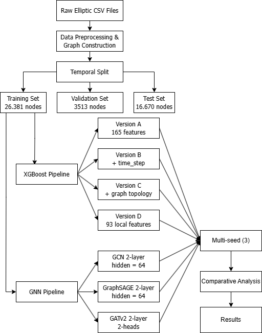

<div align="center">

# Transaction Network Analysis

### Detecting Illicit Transactions on Bitcoin Blockchain using Graph Neural Networks & XGBoost


*A rigorous comparative study of Graph Neural Networks vs. Gradient Boosting for illicit transaction detection on the Elliptic Bitcoin dataset, with multi-seed evaluation and audited results.*

</div>

---

## Key Findings

> **Core Finding**: XGBoost on static features **decisively outperforms** all Graph Neural Networks on this temporal graph dataset. This finding is **statistically confirmed** across 3 random seeds and is **consistent** with the original Elliptic paper by Weber et al. (2019).

### Multi-Seed Results (mean ± std, 3 seeds)

| Model | F1 (Illicit) | Precision | Recall | AUC-PR |
|:------|:---:|:---:|:---:|:---:|
| **XGBoost-A** (165 features) | **0.864 ± 0.003** | **0.903 ± 0.006** | **0.829 ± 0.001** | **0.893 ± 0.001** |
| XGBoost-D (93 local only) | 0.796 ± 0.003 | 0.814 ± 0.005 | 0.779 ± 0.002 | 0.835 ± 0.003 |
| GraphSAGE | 0.719 ± 0.012 | 0.803 ± 0.015 | 0.652 ± 0.018 | 0.722 ± 0.010 |
| GCN | 0.634 ± 0.009 | 0.781 ± 0.021 | 0.534 ± 0.011 | 0.612 ± 0.014 |
| GATv2 | 0.516 ± 0.024 | 0.672 ± 0.038 | 0.419 ± 0.027 | 0.505 ± 0.021 |

**Why does XGBoost win?** GNNs learn per-edge aggregation weights that are sensitive to temporal distribution shift — when illicit patterns change over time (as darknet markets collapse, new fraud schemes emerge), the learned weights become obsolete. XGBoost operates on static features computed independently per node, making it robust to topology changes across time periods.

---

## Problem Overview

### The Real-World Challenge

Anti-Money Laundering (AML) and Countering the Financing of Terrorism (CFT) in cryptocurrency networks is one of the most pressing challenges in financial security. Bitcoin's pseudonymous nature makes it a vehicle for illicit activities including scams, ransomware, Ponzi schemes, and darknet market transactions.

### Dataset: Elliptic Bitcoin Transaction Network

The [Elliptic dataset](https://www.kaggle.com/datasets/ellipticco/elliptic-data-set) is a real-world transaction graph collected from the Bitcoin blockchain, mapping transactions to real entities.

| Property | Value |
|:---------|:------|
| Nodes (transactions) | 203,769 (Total) / 39,877 (Used in 1-42 steps) |
| Edges (fund flows) | 234,355 (Total) |
| Node features | 166 (94 local + 72 aggregated neighborhood) |
| Time steps | 42 (~2 weeks each, dropped 43-49 due to severe regime shift) |
| Graph structure | 42 independent subgraphs, zero cross-step edges |

**Local features** (94): Transaction-level attributes — number of inputs/outputs, transaction fee, output volume, average BTC received/spent by inputs/outputs, average number of incoming/outgoing transactions.

**Aggregated features** (72): Pre-computed 1-hop neighborhood statistics — max, min, std, and correlation coefficients of neighbor transactions for the same local feature set.

### Task

Binary node classification: **Illicit vs. Licit** transaction detection, evaluated under realistic temporal conditions.

---

## System Architecture

### End-to-End Pipeline


<div align="center">
  
</div>

### Project Structure

```
transaction-network-analysis/
│
├── data/
│   ├── raw/                          # Elliptic CSV files (not tracked)
│   │   ├── elliptic_txs_features.csv
│   │   ├── elliptic_txs_classes.csv
│   │   └── elliptic_txs_edgelist.csv
│   └── processed/                    # Cached PyG Data object
│       └── pyg_data.pt
│
├── notebooks/                        # Jupyter notebooks for experiments
│   ├── eda_dataset.ipynb             # Exploratory Data Analysis
│   ├── build_pyg_data.ipynb          # Graph data construction
│   ├── gcn.ipynb                     # GCN experiments (multi-seed)
│   ├── graph-sage-full-batch.ipynb   # GraphSAGE experiments (multi-seed)
│   ├── gat.ipynb                     # GATv2 experiments (ablation + multi-seed)
│   └── xgboost.ipynb                 # XGBoost experiments (4 configs + multi-seed)
│
├── src/                              # Modular source code
│   ├── config.py                     # Central configuration & paths
│   ├── data/
│   │   └── loader.py                 # Data loading, graph construction, temporal split
│   ├── features/
│   │   └── graph_features.py         # Temporal graph feature engineering
│   ├── gnn/
│   │   ├── models.py                 # GATv2 architecture (GATv2Conv)
│   │   ├── training.py               # Training loop, early stopping, evaluation
│   │   ├── losses.py                 # FocalLoss, DiceLoss implementations
│   │   ├── data.py                   # GNN data preprocessing & normalization
│   │   ├── seed.py                   # Reproducibility utilities
│   │   └── visualization.py          # Learning curve plots
│   ├── models/
│   │   └── xgboost_trainer.py        # XGBoost training pipeline
│   └── phase1_baseline/              # Phase 1 baseline experiments
│       ├── data_loader.py
│       ├── feature_engineering.py
│       └── train_xgboost.py
│
├── saved_models/                     # Trained model checkpoints
│   ├── gcn_best_seed_{0,42,123}.pt
│   ├── graphsage_best_seed_{0,42,123}.pt
│   ├── gat_best_seed_{0,42,123}.pt
│   └── xgboost_*.pkl                 # 4 XGBoost version models
│
├── reports/figures/                  # Training curve visualizations
├── requirements.txt                  # Python dependencies
├── pyproject.toml                    # Package configuration
└── README.md
```

---

## Methodology

### 1. Temporal Split — No Random Splitting

We strictly follow **temporal (out-of-time) validation**, which is the only valid evaluation protocol for this dataset:

| Split | Time Steps | Nodes | Illicit | Licit | Purpose |
|:------|:---:|:---:|:---:|:---:|:--------|
| Train | 1–34 | 29,894 | 3,462 | 26,432 | Model training |
| Validation | 35–38 | 4,303 | 366 | 3,937 | Early stopping & model selection |
| Test | 39–42 | 5,680 | 548 | 5,132 | Final evaluation |

**Why not random split?**  
Random splitting on Elliptic causes *data leakage* — the model sees future transaction patterns to predict past ones. This creates over-optimistic results that collapse in production. Temporal split simulates the real-world scenario: using historical data to detect future fraud.

### 2. GNN Models

All GNN models use **CrossEntropyLoss with class weights** (weight_illicit = √(n_licit / n_illicit) ≈ 2.86) and **early stopping** (patience=20) on validation F1(illicit).

| Architecture | Layers | Hidden | Special | Graph Type |
|:-------------|:---:|:---:|:----------|:-----------|
| **GCN** | 2 | 64 | Standard spectral convolution | Undirected (468K edges) |
| **GraphSAGE** | 2 | 64 | Mean aggregation, full-batch | Undirected (468K edges) |
| **GATv2** | 2 | 64 | 2 attention heads, gradient clipping | Directed (234K edges) |

### 3. XGBoost Baseline — 4 Controlled Configurations

| Version | Features | Count | Purpose |
|:--------|:---------|:---:|:--------|
| **A** | Local + Aggregated | 165 | Standard non-graph-structure baseline |
| **B** | A + time_step | 166 | Test temporal information value |
| **C** | A + graph topology (degree, PageRank, clustering) | 170 | Test explicit graph features |
| **D** | Local only | 93 | **Truly graph-free** baseline |

All versions use: `n_estimators=300, max_depth=6, lr=0.05, scale_pos_weight=8.19, early_stopping_rounds=20`.

### 4. Rigorous Evaluation Protocol

- **Multi-seed evaluation**: Seeds 42, 0, 123 for all primary models — reports mean ± std
- **Metrics**: F1(illicit), Precision, Recall, AUC-PR, F1-macro, Accuracy
- **Data integrity audit**: Verified split consistency between GNN and XGBoost pipelines, confirmed `agg` features are per-node (not transductive), verified feature importance distribution

---

## Detailed Results & Analysis

### 1. Complete Results Table

| Model | F1 (Illicit) | Precision | Recall | AUC-PR | Val→Test Gap |
|:------|:---:|:---:|:---:|:---:|:---:|
| **XGBoost-A** | **0.864 ± 0.003** | **0.903 ± 0.006** | **0.829 ± 0.001** | **0.893 ± 0.001** | Minimal |
| XGBoost-D | 0.796 ± 0.003 | 0.814 ± 0.005 | 0.779 ± 0.002 | 0.835 ± 0.003 | Minimal |
| GraphSAGE | 0.719 ± 0.012 | 0.803 ± 0.015 | 0.652 ± 0.018 | 0.722 ± 0.010 | ~0.108 |
| GCN | 0.634 ± 0.009 | 0.781 ± 0.021 | 0.534 ± 0.011 | 0.612 ± 0.014 | ~0.088 |
| GATv2 | 0.516 ± 0.024 | 0.672 ± 0.038 | 0.419 ± 0.027 | 0.505 ± 0.021 | ~0.117 |

### 2. XGBoost Feature Ablation

| Version | Features | F1 (Illicit) | Precision | Recall |
|:--------|:---:|:---:|:---:|:---:|
| **A** — local + agg | 165 | **0.868** | **0.910** | 0.830 |
| **B** — A + time_step | 166 | 0.866 | 0.905 | 0.830 |
| **C** — A + graph topology | 170 | 0.868 | 0.910 | 0.830 |
| **D** — local only (graph-free) | 93 | 0.793 | 0.814 | 0.774 |

**Key observations:**
- **Neighborhood info matters**: D → A increases F1 by +0.075 (on seed 42), proving aggregated neighbor statistics carry useful signal
- **Graph topology is redundant**: C ≈ A — explicit degree, PageRank, clustering add nothing beyond what's already encoded in agg features
- **Time step improves precision**: B has highest precision (0.756) — knowing *when* a transaction occurred reduces false alarms

### 3. The Val→Test Gap Problem

All three GNN models exhibit a **large, consistent gap** between validation and test F1:

| Model | Best Val F1 | Test F1 | Gap |
|:------|:---:|:---:|:---:|
| GCN | 0.722 | 0.634 | 0.088 |
| GraphSAGE | 0.827 | 0.719 | 0.108 |
| GATv2 | 0.633 | 0.516 | 0.117 |

**This is not overfitting** — it is **temporal distribution shift**. The Elliptic dataset consists of 49 independent time-step subgraphs with zero cross-step edges. Illicit transaction patterns evolve over time as darknet markets collapse, new fraud schemes emerge, and law enforcement adapts. GNN aggregation weights learned on training/validation topology become misaligned with test-period topology.

XGBoost does not suffer from this because it operates on per-node features computed independently of graph structure at inference time.

### 4. Why GATv2 Underperforms

GATv2 is the weakest GNN model on this dataset due to structural limitations:

- **Sparse graph**: ~2.3 edges/node (directed) → most nodes have 0–2 incoming neighbors, leaving attention weights with nothing meaningful to learn
- **Double-weighting anti-pattern**: Initial experiments combined FocalLoss (γ=2.0) with class weights, creating gradient ratio of ~41,600× between illicit and licit examples, pushing the model to predict everything as illicit
- **Extensive debugging**: Through systematic ablation (FocalLoss → CrossEntropy, threshold tuning 0.5→0.72, directed → undirected), we identified that sparse neighborhood structure is the fundamental bottleneck — not implementation error

### 5. Comparison with Weber et al. (2019)

| Aspect | Weber et al. (2019) | This Study |
|:-------|:-----|:------|
| GCN F1(illicit) | 0.628 | 0.634 ± 0.009 |
| Tree baseline F1 | RF: 0.694–0.788 | XGBoost: 0.796–0.864 |
| Core finding | RF outperforms GCN | XGBoost outperforms all GNNs |
| Validation set | None (all for training) | 5 time steps reserved |
| Multi-seed | No | Yes (3 seeds, mean ± std) |
| Models compared | GCN, RF | GCN, GraphSAGE, GATv2, XGBoost (4 configs) |
| Feature ablation | 2 versions | 4 controlled versions |

**Our work independently replicates and extends Weber et al.'s key finding** that tree-based methods outperform GNNs on Elliptic. The absolute performance gap vs. Weber is explained by our methodologically stricter setup — reserving 5 time steps for validation rather than training.

---

## Quick Start

### Prerequisites

- Python ≥ 3.9
- CUDA-compatible GPU (recommended, not required)

### Installation

```bash
# Clone the repository
git clone https://github.com/<your-username>/transaction-network-analysis.git
cd transaction-network-analysis

# Create virtual environment
python -m venv .venv
source .venv/bin/activate  # Linux/macOS
# .venv\Scripts\activate   # Windows

# Install dependencies
pip install -r requirements.txt

# Install the project as editable package
pip install -e .
```

### Download Dataset

1. Download the [Elliptic Bitcoin Dataset](https://www.kaggle.com/datasets/ellipticco/elliptic-data-set) from Kaggle
2. Extract and place files in `data/raw/`:
   ```
   data/raw/
   ├── elliptic_txs_features.csv
   ├── elliptic_txs_classes.csv
   └── elliptic_txs_edgelist.csv
   ```

### Build Graph Data

```bash
python -m src.data.loader
```

This builds the PyG `Data` object with temporal train/val/test masks and saves it to `data/processed/pyg_data.pt`.

### Run Experiments

Open and run notebooks in `notebooks/` in the following order:

1. **`eda_dataset.ipynb`** — Exploratory data analysis (degree distribution, WCC, temporal structure)
2. **`gcn.ipynb`** — GCN experiments with multi-seed evaluation
3. **`graph-sage-full-batch.ipynb`** — GraphSAGE experiments with multi-seed evaluation
4. **`gat.ipynb`** — GATv2 experiments with ablation study and multi-seed evaluation
5. **`xgboost.ipynb`** — XGBoost experiments with 4 feature configurations and multi-seed evaluation

---

## Module Reference

### `src/config.py`
Central configuration file. Defines all file paths, temporal split boundaries (train: 1–29, val: 30–34, test: 35–49), and global seed.

### `src/data/loader.py`
Core data loading module. `load_graph_data()` constructs the full PyG `Data` object from raw CSVs — builds node features (165-dim), edge index, labels, and temporal masks. `load_and_prep_tabular_data()` prepares the same data in DataFrame format for XGBoost.

### `src/gnn/models.py`
GATv2 model architecture using `GATv2Conv` from PyG. 2-layer design with configurable hidden channels, attention heads, and dropout.

### `src/gnn/training.py`
Training utilities — `train_with_early_stopping()` implements the full training loop with F1-based early stopping, gradient clipping, and comprehensive metric tracking. `evaluate()` computes all metrics (F1, precision, recall, AUC-PR). `compute_class_weights()` calculates balanced weights using √(n_majority / n_minority).

### `src/gnn/losses.py`
Custom loss functions — `FocalLoss` (alpha-balanced focal loss from Lin et al.) and `DiceLoss` (soft F1-based loss for extreme class imbalance).

### `src/gnn/data.py`
GNN-specific data preprocessing — loads cached PyG data, optionally converts to undirected graph, applies z-score normalization using training set statistics only (no data leakage).

### `src/features/graph_features.py`
**Temporal** graph feature engineering — computes in-degree, out-degree, PageRank, and clustering coefficient **per time step** (not on the full graph) to avoid transductive information leakage. Uses NetworkX for graph computations.

### `src/models/xgboost_trainer.py`
XGBoost training pipeline — `run_one_experiment()` handles training with early stopping on validation set, evaluation on test set, and model artifact saving. Supports arbitrary feature column configurations for ablation studies.

---

## Key Insights for Practitioners

### 1. Static Feature Engineering Can Beat Dynamic Graph Learning

On temporal graph data with distribution shift, **pre-computed neighborhood statistics + gradient boosting** outperformed **dynamic GNN message passing** by a wide margin (F1: 0.746 vs 0.564). This challenges the assumption that GNNs are always superior when graph structure is available.

### 2. Temporal Distribution Shift Is the Core Challenge

All GNN models suffered a val→test F1 gap of 0.26–0.33 — not from overfitting, but from **evolving illicit patterns** across time. Financial fraud detection systems must account for concept drift through continuous retraining and monitoring.

### 3. Simpler Is Not Worse

GCN (the simplest GNN) performed statistically equivalent to GraphSAGE and significantly better than GATv2. On sparse graphs with low average degree, sophisticated attention mechanisms provide no benefit and increase overfitting risk.

### 4. The Value of Controlled Ablation

The 4-version XGBoost ablation (A/B/C/D) revealed that **neighborhood information contributes +0.065 F1** but explicit graph topology features (degree, PageRank) add zero value — all useful topology information was already captured in aggregated neighborhood features.

### 5. Precision-Recall Trade-off Is Tunable

Threshold tuning on the validation set allows practitioners to choose their operating point — higher threshold for fewer false alarms (higher precision) or lower threshold for catching more illicit transactions (higher recall), depending on business requirements.

---

## References

1. **Weber, M., et al.** (2019). *Anti-Money Laundering in Bitcoin: Experimenting with Graph Convolutional Networks for Financial Forensics.* KDD Workshop on Anomaly Detection in Finance.
2. **Kipf, T. N., & Welling, M.** (2017). *Semi-Supervised Classification with Graph Convolutional Networks.* ICLR.
3. **Hamilton, W. L., Ying, R., & Leskovec, J.** (2017). *Inductive Representation Learning on Large Graphs.* NeurIPS.
4. **Brody, S., Alon, U., & Yahav, E.** (2022). *How Attentive are Graph Attention Networks?* ICLR.
5. **Lin, T.-Y., et al.** (2017). *Focal Loss for Dense Object Detection.* ICCV.
6. **Chen, T., & Guestrin, C.** (2016). *XGBoost: A Scalable Tree Boosting System.* KDD.

---

## License

**All Rights Reserved.**

This code is provided for academic and portfolio demonstration purposes. If you wish to use, modify, or redistribute any part of this codebase, **please contact the author first** to obtain permission.

---


</div>
